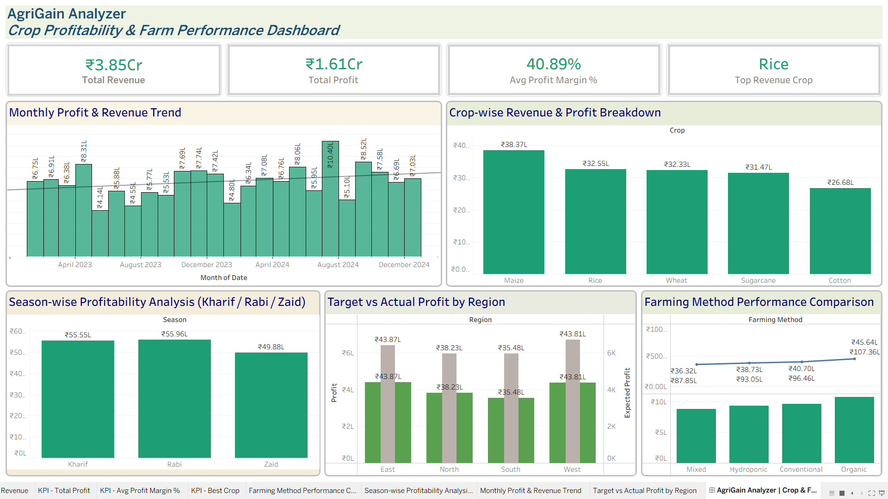

# AgriGain Analyzer — Agricultural Profitability Dashboard

## Project Overview
Interactive Tableau dashboard analysing ₹3.85Cr agricultural revenue 
across 5 crops, 4 regions, and 3 farming methods using 500 records 
spanning 2023–2024.

## Live Dashboard
[View on Tableau Public] https://public.tableau.com/views/AgriGainAnalyzerDashboard/AgriGainAnalyzerCropFarmProfitabilityDashboard?:language=en-US&publish=yes&:sid=&:redirect=auth&:display_count=n&:origin=viz_share_link

## Dashboard Preview

## Key Insights
- Organic farming generates ₹45.64L total profit — 13% higher than Conventional
- Rice achieves highest average revenue per harvest at ₹86.7K
- West region leads total revenue at ₹1.07Cr
- Rabi season is most profitable at ₹55.96L avg profit

## Tools Used
- Tableau Public
- Microsoft Excel / CSV
- Calculated Fields: Profit Margin %, Cost of Farming, Target Achievement %

## Dataset
- 500 agricultural records
- 5 crops: Maize, Rice, Wheat, Sugarcane, Cotton
- 4 regions: East, West, North, South
- 3 seasons: Kharif, Rabi, Zaid
- 4 farming methods: Organic, Conventional, Hydroponic, Mixed

## Charts in Dashboard
1. KPI Strip — Total Revenue, Total Profit, Avg Profit Margin, Top Crop
2. Monthly Profit & Revenue Trend (with trend line)
3. Crop-wise Revenue & Profit Breakdown
4. Season-wise Profitability Analysis
5. Target vs Actual Profit by Region
6. Farming Method Performance Comparison

## Author
Vansh Dungrani
B.Tech Computer Engineering — VVP Engineering College, Rajkot
linkedin.com/in/vansh-dungrani
